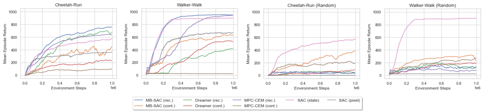

# Optimization of Latent Dynamics Models with Unsupervised Representation Learning

This is the official PyTorch implementation of my Master thesis. The main goal of this work was to optimize latent 
dynamics models with unsupervised representation learning. While most current approaches rely on generative methods for 
representation learning, this work emphasizes the advantages of discriminative methods, especially in terms of visual 
generalization to unknown situations.


## Prerequisites
Get dependencies:
```
pip install -r requirements.txt
```

Install [DMC Remastered](https://github.com/QData/dmc_remastered) from source:
```
git clone https://github.com/QData/dmc_remastered.git
cd dmc_remastered
pip install -e .
```

Install [mujoco-py](https://github.com/openai/mujoco-py) from source:
```
git clone https://github.com/openai/mujoco-py.git
cd mujoco-py
pip install -e .
```

## Instruction
### Agents
- **MB-SAC**: Model-based variant of the SAC algorithm that only uses experience simulated by the latent dynamics model.
- **Dreamer**: An actor-critic reinforcement learning approach entirely based on imagined trajectories. Dreamer 
backpropagates through a value model to optimize the policy.
- **MPC-CEM**: Planning algorithm that combines MPC with the shooting method CEM.

Train the agent with MB-SAC:
```
cd scripts
python train_mb_sac.py
```

Train the agent with Dreamer:
```
cd scripts
python train_dreamer.py
```

Train the agent with MPC-CEM:
```
cd scripts
python train_shooting_mpc.py
```

Train the agent with SAC (baseline):
```
cd scripts
python train_baseline.py
```

In your console, you should see training progress printouts that look like:
```
Training progress:   8%|▊         | 8/100 [04:11<45:58, 29.99s/it]
```

### Load model
Instead of starting a training run from scratch it is possible to load the model weights from previous training runs.
Exemplary model weights are given in the `/output` folder. 

Load a model and continue training:
```
cd scripts
python train_mb_sac.py --load_model --load_model_dir "../output/mbsac_contrastive/cheetah-run-2021-05-04-06-34-28/model/model_final"
```

### Configuration
#### Environment
This repository supports [Gym](https://github.com/openai/gym) and 
[DeepMind Control Suite](https://github.com/deepmind/dm_control) environments. You can set the `env_type`
configuration variable to `gym` ,or `dm_control`. For Gym environments you need to set `env_name`, for 
DMC environments `domain_name` and `task_name`.

#### Representation Learning
You can set the type of representation learning in `image_loss_type`. The following options are available for learning 
representations:
- `reconstruction`: A generative reconstruction loss based on the original image, and the one generated
  by a decoder network is used.
- `obs_embed_contrast`: A contrastive loss based on the observation embedding, and the latent state of 
  the same observation is used.
- `augment_contrast`: A contrastive loss based on the latent states of two different augmented views of the original
  observation is used.
- `aug_obs_embed_contrast`: A contrastive loss based on the latent state, and the observation embedding of two different 
  augmented views of the original observation is used.
  
Using a contrastive loss for representation learning requires setting a similarity measure. You can set the `similarity`
configuration variable to `dot_product`, `bilinear_product`, or `cosine`. The cosine similarity may be further regulated
by the temperature parameter `curl_temperature`.

#### Imagination Horizon
Increasing the imagination horizon during training may improve the final performance. You can activate 
the dynamic imagination horizon by setting `horizon_increase` > 0.0. During training the horizon 
increases linearly up to the maximal horizon specified in `max_imagination_horizon`.

#### Real Data
By default, the agent is trained purely on simulated data. By setting `use_real_data` to `True`, real 
data is collected in a separate replay buffer and is used for training the agent. While at the beginning of the 
training more real data is used, at the end of the training more simulated data is used.

## Results


## Credits
This repository uses large chunks of code from:
- [PlaNet_PyTorch](https://github.com/cross32768/PlaNet_PyTorch)
- [Dreamer_PyTorch](https://github.com/cross32768/Dreamer_PyTorch)
- [CURL](https://github.com/MishaLaskin/curl)
- [SAC+AE](https://github.com/denisyarats/pytorch_sac_ae)
